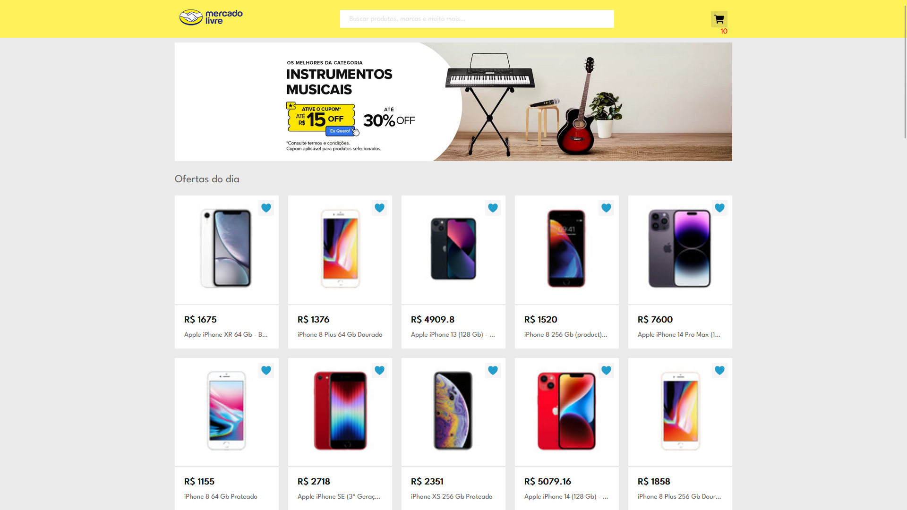
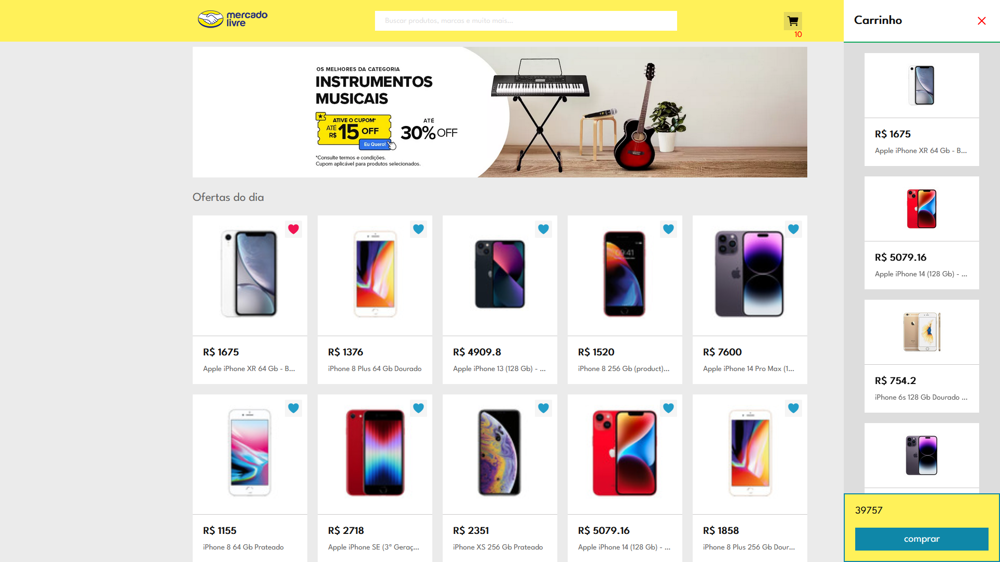

## Busca e Gerenciamento de Produtos utilizando a API do Mercado Livre

### Descrição:
O projeto é uma aplicação web desenvolvida com HTML, CSS e JavaScript. Através dessa aplicação simples e intuitiva, os usuários podem explorar e gerenciar produtos utilizando a API do Mercado Livre.

Com essa aplicação, é possível realizar buscas por produtos específicos e adicionar produtos favoritos para referência futura. Além disso, os usuários têm a opção de remover itens indesejados da lista de favoritos.

A interface do projeto é amigável e responsiva, proporcionando uma experiência agradável aos usuários. Através da integração com a API do Mercado Livre, são exibidas informações relevantes sobre os produtos, incluindo título, descrição, preço e imagens.

- Com o recurso de busca por diferentes tipos de produtos através da api do Mercado Livre, os usuários podem digitar palavras-chave para obter uma lista atualizada de resultados correspondentes aos critérios fornecidos.

O projeto foi criado com foco em estuda desenvolvimento web, e um projeto simples mas que aborda varios conceitos sobre programação utilizano javascript e estilização com css. o projeto e focando apenas para em estudo!